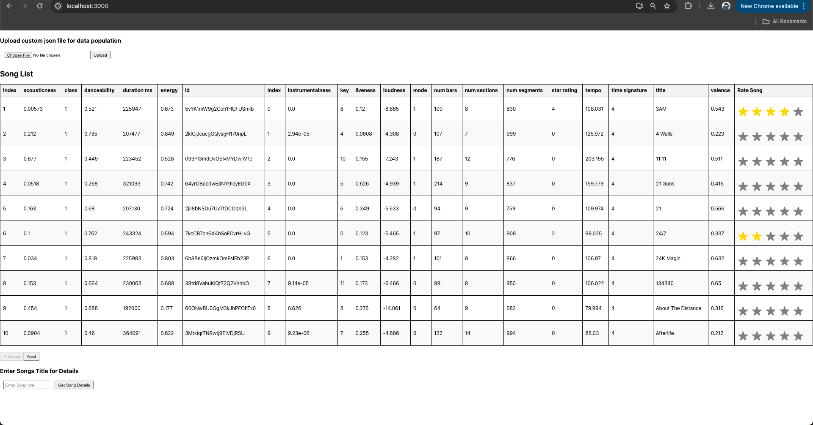
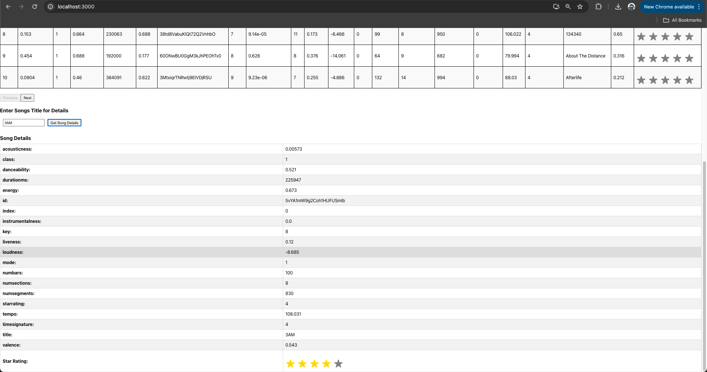

## Overview

Playlist Manager is a web application for managing and rating songs. It includes a backend API built with Flask, a SQLite database for storing song data, and a frontend built with React.

## Running the Project with Docker Compose

### Prerequisites

Make sure you have Docker and Docker Compose installed on your system. You can download and install them from the following links:

- [Docker](https://www.docker.com/get-started)
- [Docker Compose](https://docs.docker.com/compose/install/)

### Steps to Run

1. **Clone the Repository:**

   ```sh
   git clone https://github.com/yourusername/playlistmanager.git
   cd playlistmanager

2. **Build and Run the Containers:**

    In the project root directory, run the following command to build and start the Docker containers.
    ```sh
    docker-compose up --build
    ```

    This command will:
   - Build the backend and frontend Docker Images.
   - Setup the SQLite database.
   - Start the backend server on port 5001
   - Start the frontend server on port 3000
  
3. **Access the Application**
   - **Frontend:** Open your browser and navigate to `http://localhost:3000` to access the frontend.
   - **Backend API:** You can access the backend API at `http://localhost:5001`

### Stopping the Application

  To stop the running containers, use:
  ```sh
  docker-compose down
  ```

### Running Tests

  Tests are included in the `tests` directory. To run the tests, make sure the Docker containers are built and then use the following command:
  ```sh
  docker-compose run web python -m unittest discover -s tests
  ```

### Project Details

  - **Backend:**
    - `app.py`: Main Flask application file.
    - `data_processor.py`: Contains the `DataProcessor` class for normalizing and processing song data.
    - `database_manager.py`: Contains the `DatabaseManager` class for managing database operations.
    - `requirements.txt`: Python dependencies
   
  - **Database:**
    - `songs.db`: SQLite database file.
    - `playlist.json`: JSON file for populating data to db
   
  -  **Frontend:**
    - `src/`: React application source code.
    - `Dockerfile`: Dockerfile for building the frontend Docker image

  - **Tests:**
    - `test_database_manager.py`: Unit tests for `DatabaseManager`
    - `test_data_processor.py`: Unit tests for `DataProcessor`

  - **Docker Configuration:**
    - `docker-compose.yml`: Docker Compose configuration file
    - `Dockerfile`: Dockerfile for building the backend Docker image
   
### Backend API Endpoints

  1. `GET/songs` - Frontend should be able to request all the items in a normalized data set.
      - Description: Retrieve all songs with pagination
      - Query Parameters:
        - `page`: Page number (default 1)
        - `perPage`: Number of items per page (default 10)
      - Response:
        ```sh
          {
            "total_items": 100,
            "items_per_page": 10,
            "total_pages": 10,
            "songs": [
              {
                "id": "5vYA1mW9g2Coh1HUFUSmlb",
                "title": "Song1",
                "danceability": 0.8,
                "energy": 0.6,
                "tempo": 120,
                "star_rating": 4
              },
              ...
            ]
          }
         ```
      
  2. `GET/song` - Given a title as input, return all the attributes of that song.
      - Description: Retrieve details of a song by its title.
      - Query Parameters:
        - `title`: Title of the song
      - Response:
        ```sh
          {
            "id": "5vYA1mW9g2Coh1HUFUSmlb",
            "title": "Song1",
            "danceability": 0.8,
            "energy": 0.6,
            "tempo": 120,
            "star_rating": 4
          }
        ``` 
  3. `POST/rate` - User should be able to rate a song using star rating (5 stars being highest)
      - Description: Rate a song by its title
      - Request Body:
        ```sh
          {
            "title": "Song1",
            "rating": 5
          }
        ```
      - Response:
          ```sh
          {
            "message": "Rating updated successfully"
          }
          ```

### Frontend Features

  1. When application is loaded, on launch it makes an API request to the backend requesting all the items in a normalized Data set.
  2. The responses received are rendered in a tabular view.
  3. The table shows all the items in a batch of 10 rows at a time. Used pagination in the table view to see all the batches of 10 rows.
  4. Each column of the table is sortable. On clicking the column it toggles the column values in the ascending or descending order.
  5. User can input the song title, frontend requests a api call and searches the db, further use can rate it in the fetched data.
  6. User can rate it with a scale of 5 stars. The ratings are stored in the db.

### Screenshots
- All paginated songs

 

- Search song by title


  

